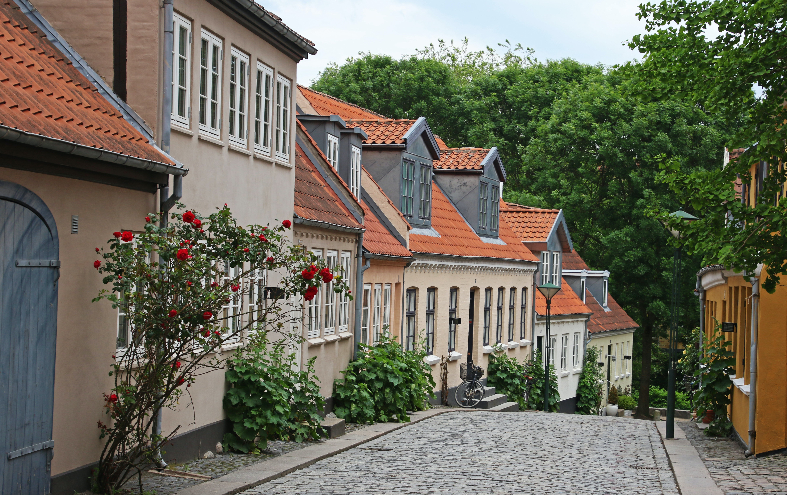

<link rel="shortcut icon" type="image/x-icon" href="favicon.ico?">

# Welcome to Newer York!

#### Also known as "New New York"

Newer York is the superior successor to New York. Newer York's healthcare is the best in the world, with clean, efficient facilities and new technologies and treatments are constantly being developed. With a fair democracy and a stable, uncorrupt government, Newer York's government is transparent and there are laws against discrimination. With convenient access to goods and services, accessible public transportation, excellent recreational facilities, and affordable housing, living here is comfortable. And you can be rest assured knowing that your safety is our number one priority, With an effective police force and good foreign relations, conflict is minimal. Of course, Newer York strives to be sustainable, with many environmental policies and a switch over to nuclear energy, we try to preserve the environment and our resources so generations now and in the future can live a healthy and happy life.

## Availability of Goods and Services

Newer York has numerous retail stores across the city, with quality goods and services provided in each one. From high-end brands to budget-friendly options, shoppers can find everything they need. Dining options in Newer York are some of the best in the world, with exquisite cuisine from all around the world. Essentials such as food and clean water are accessible across the city, cheap and available. We try to be sustainable, however, so local businesses are subsidised and there is a push to use locally-produced resources. There have also been many initiatives to transition over to recycled plastics and paper.

## Healthcare

Newer York's affordable healthcare is the best in the world. High-quality doctors and nurses are always at your service, and several sanitation policies enforce cleanliness in our healthcare facilities. New technologies and treatments are constantly being developed and improved to provide the best healthcare. We prioritise regular check-ups and try to prevent emergencies before they happen. Our emergency services respond almost immediately during an accident. Newer York has supported many initiatives to improve the welfare and health of the community, and we highly encourage physical activity, healthy eating, and mental well-being. Good biking infrastructure means the community is more physically active, promoting physical exercise and a healthier community. Healthcare facilities are always close by in case of an emergency, and there have been many initiatives to teach the community important topics like healthy eating, how to do CPR, and the importance of physical exercise.

## Governance

The city of Newer York has a fair democracy, ensuring every citizen has their voice heard. There are protections against the tampering of elections and votes, and Newer York has laws against any discrimination and guarantees that judgement is fair. Newer York's foreign relations are strong, the city actively encourages cooperation between foreign nations, promoting peace, strong alliances, and global progress. Several laws ensure there is little to no corruption and that power is not abused for self-gain or short-term profits. Newer York's government is transparent, public officials are held accountable for their actions and information on governmental activity and policies is required to be disclosed by law. This ensures that the government remains uncorrupt and power is not abused.

## Safety

In Newer York, your safety is our top priority. Our police force is effective and responds quickly to settle any local conflict and crime. Patrol officers are always around to check every corner of the street for trouble. Traffic accidents happen rarely, as most people in Newer York tend to use our incredibly effective public transportation and our biking infrastructure is outstanding. However, we still implement strict traffic laws, and there have been many initiatives to reinforce road safety, not driving when you're drunk, and keeping your car locked in case of theft. With good foreign relations, there is little to no war and international conflict. We have peace treaties and military alliances with other nations, ensuring peace and the safety of the community. As Newer York relies heavily on nuclear power, we make sure we have safety measures and precautions to reduce the risk of a meltdown, and the reactor itself is far away from citizens. Natural disasters rarely happen as Newer York is far from fault lines, and there are no nearby volcanoes. 

## Housing

Housing in Newer York is cheap and available,

and there are plenty of options to choose from. You can choose a scenic view of Azure Bay, or you could decide to live in an apartment near the bustling city centre with excellent facilities a few footsteps away. You could also choose to live in the spacious countryside and be free from the chaos of the city. Newer York's housing is, of course, powered by eco-friendly nuclear energy. However, we recognise that some are not economically stable enough to afford housing, so we have free public housing that anyone can stay in, and basic needs are fulfilled, with access to clean water, electricity, and a place to rest, as well as being regularly cleaned.

## Transport

Public transport is easily accessible, with our excellent subway system reaching every corner of the city, allowing convenient travel 24/7. Our trains are fast and efficient, and they're all powered by nuclear energy, an eco-friendly alternative to fossil fuels. Accessibility is a key priority in Newer York, so our train stations are equipped with elevators and ramps, and we encourage the community to give their seat to those who need it more than them. In train stations, there are both audio and visual announcements when a train arrives or leaves. Not only that, in Newer York, you can get almost anywhere on a bike, with bike lanes stretching across the city and high-quality biking infrastructure available everywhere in the city. There are many bike rental stations and bike lanes are nice and wide. Although we highly encourage biking and public transportation, Newer York has well-maintained roads with advanced traffic infrastructure that ensures the safety of the community, and traffic accidents are rare. There are also strict traffic laws to ensure safety on the road.

## Recreational Facilities

Newer York has a variety of entertainment facilities that make living here a blast! 

Visit Azure Bay, a breathtaking beach renowned for its cleanliness and purity. We work hard to preserve the beauty of Azure Bay and have many environmental policies to ensure it remains free of pollution. Anyone can take a relaxing break from work on Azure Bay, as long as they remember to not pollute it with waste so it remains pristine for the community. We also boast the York Library, one of the largest libraries in Europe! It's a treasure trove of information from all around the world! Our massive sports stadium hosts a variety of athletic events, tournaments, and professional matches. There's also our indoor public pool, with crystal clear waters, a place where swimmers from beginners to experts can have fun swimming! This vast array of recreational activities results in a huge tourism industry, bringing many jobs and increasing economic prosperity. 

## Sustainability

Newer York has an effective recycling program, recycling bins are everywhere in the city and advanced sorting techniques are used to minimise waste sent to landfills. We also recognise that composting is an effective and useful way to reuse waste, and we actively encourage our community to separate food scraps from other waste. We are also actively working on minimising the amount of single-use plastics we use, and we are trying to transition over to using recycled paper. Newer York is renowned for fully switching to nuclear power. We effectively recycle used nuclear fuel to reduce the amount of nuclear waste we produce. We also highly encourage biking and have invested heavily in biking infrastructure, promoting physical fitness, reducing traffic congestion, and minimising our carbon footprint. We care about the environment, so we fund initiatives to raise awareness of environmental issues and promote sustainable practices so current and future generations can live in a better world.

## Conclusion

From great healthcare, an emphasis on your safety and a strong and stable government to convenient transportation, accessible goods and services, cheap housing and amazing recreational activities, Newer York has everything you could want! 

Not only that, Newer York has a large focus on being sustainable, minimising waste sent to landfills, promoting many environmental initiatives, and fully switching over to nuclear energy, one of the better alternatives to fossil fuels.

## Sources

- A Gentle Footprint. (n.d.). Fogo Island Inn. [https://fogoislandinn.ca/contact-us/a-gentle-footprint/](url)
- Poe - Fast, Helpful AI Chat. (n.d.). Poe.com. [https://poe.com](url)
- World Nuclear Association. (2018). Processing of Used Nuclear Fuel - World Nuclear Association. World-Nuclear.org. [https://world-nuclear.org/information-library/nuclear-fuel-cycle/fuel-recycling/processing-of-used-nuclear-fuel.aspx](url)

### I only used Poe as a reference, I didn't generate the whole thing with AI (most of the information it spat out was garbage anyway and probably exceeded the word count)
